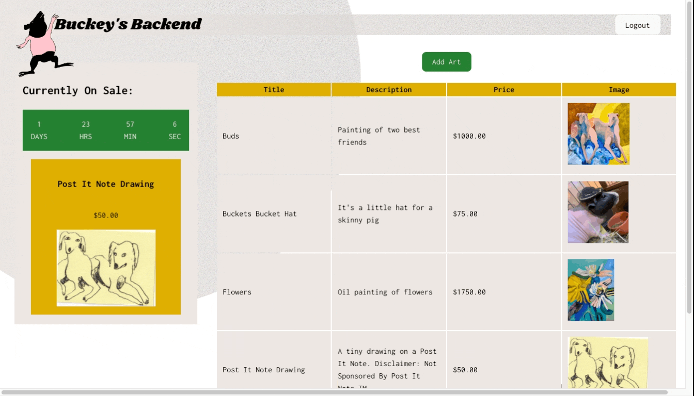
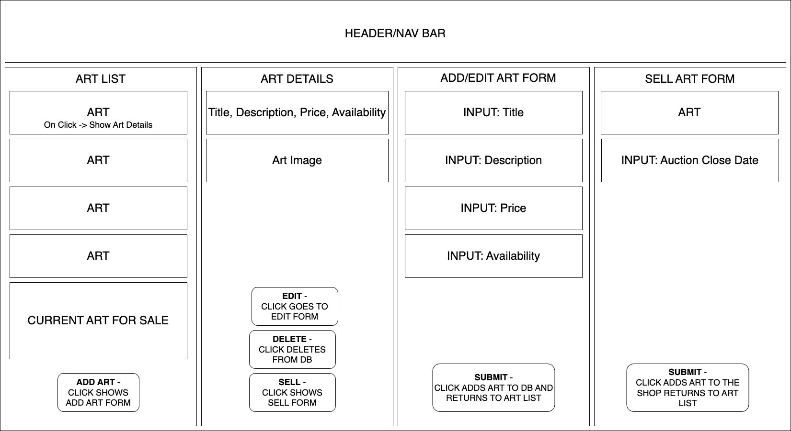

<h1>BUCKEY'S ONE STOP ART SHOP  </h1>

### By Emma Gerigscott

## Table Of Contents
  1. [Web Sample](#webpage-samples)
  1. [Description](#description)
  2. [Technologies Used](#technologies-used)
  3. [Setting Up Firebase](#setting-up-firebase)
  4. [React Component Diagrams](#react-components-diagram)
    * [Frontend Components](#frontend-components)
    * [Admin Components](#admin-components)
  5. [Frontend Design](#sample-main-page-figma)
  6. [License](#license)
  7. [Project Notes](#project-notes-and-to-dos)

## Webpage Samples

<h4 align='center'>User View</h4>
<div align='center'>
  
</div>
<h4 align='center'>Admin View</h4>
<div align='center'>
  
</div>

## Description
Buckey's One Stop Art Shop is an e-commerce website that puts one piece of art up for sale at time with a countdown timer. Users can view the art and add it to the cart. The intent of this project was to make a more manageable inventory and shipping schedule for artists who may not have time to focus on building out a full inventory of art goods and prefer to work on different projects. Mainly, I created it for myself and my partner to put some of our art up for sale occassionally.

The admin page allows the owners to upload art and images of the art using Firebase Realtime Database, Firebase Storage, and Firebase Authentication to log in. The artist has full CRUD capabilities with the art and the dashboard currently displays the art that's up for sale and a list of all art available in the database.

7/27/23 -- Currently the project is not connected to a payment API. Further features will include a message to display when the time runs out or the piece has sold, checkout options for users, and the admin dashboard will include further information if the art is available or sold an quantity.

## Technologies Used

* Typescript
* React
* React with Hooks
* Firebase
  * Authentication
  * Storage
  * Realtime DB
* NoSQL
* JSX
* Node.js


## Setting Up Firebase

1. Navigate to https://firebase.google.com/ and sign in to your Google account or create a new account.
2. Click _Create a Project_ and choose a name for your project.

#### Setting up Realtime Database and .env File
1. On the home page of your project, open the left hand menu and click the build tab
2. Click on Realtime Database
3. Click Create Database, select 'Start in Test Mode'
4. Click Next, then on the next screen leave the defaults and click Enable
5. Navigate back to your project homepage by clicking Project Overview
    * Click on the </> icon 
    * Enter 'YOUR PROJECT NAME'-web as the App nickname
    * Click register app
6. Click on the settings cog next to Project Overview in the left hand menu. Select project settings. 
    * scroll down until you find a code snippet that looks like this: 
  ```
  const firebaseConfig: FirebaseConfig = {
    apiKey: import.meta.env.VITE_FIREBASE_API_KEY as string,
    authDomain: import.meta.env.VITE_FIREBASE_AUTH_DOMAIN as string,
    databaseURL: import.meta.env.VITE_FIREBASE_DATABASE_URL as string,
    projectId: import.meta.env.VITE_FIREBASE_PROJECT_ID as string,
    storageBucket: import.meta.env.VITE_FIREBASE_STORAGE_BUCKET as string,
    messagingSenderId: import.meta.env.VITE_FIREBASE_SENDER_ID as string,
    appId: import.meta.env.VITE_FIREBASE_APP_ID as string,
    measurementId: import.meta.env.VITE_FIREBASE_MEASUREMENT_ID as string
}
  ```
7. In your code editor, in the root file of your project, add a file called .env
8. Add the following code to your .env file. Replace the string values with the values found in your firebase config.

  ```
VITE_FIREBASE_API_KEY = "YOUR-UNIQUE-CREDENTIALS"
VITE_FIREBASE_AUTH_DOMAIN = "YOUR-PROJECT-NAME.firebaseapp.com"
VITE_FIREBASE_PROJECT_ID = "YOUR-PROJECT-FIREBASE-PROJECT-ID"
VITE_FIREBASE_STORAGE_BUCKET = "YOUR-PROJECT-NAME.appspot.com"
VITE_FIREBASE_MESSAGING_SENDER_ID = "YOUR-PROJECT-SENDER-ID"
VITE_FIREBASE_APP_ID = "YOUR-PROJECT-APP-ID"  
  ```

#### Setting up Authentication:
1. On the home page of your project, open the left hand menu and click the build tab
2. Click on the Authentication tab
3. Click on 'Get started'
4. Select Email/Password in the Sign-in Method tab
5. Under the Users tab, enter your name and password. This will be your admin account, as there is no available sign-up method on the webpage itself.
6. In firebase.ts in the project folder, make sure the code looks as follows: 
```
import { initializeApp } from "firebase/app";
import { getDatabase } from 'firebase/database';
import { getAuth } from 'firebase/auth';

interface FirebaseConfig {
  apiKey: string;
  authDomain: string;
  databaseURL: string;
  projectId: string;
  storageBucket: string;
  messagingSenderId: string;
  appId: string;
  measurementId: string;
}

const firebaseConfig: FirebaseConfig = {
  apiKey: import.meta.env.VITE_FIREBASE_API_KEY as string,
  authDomain: import.meta.env.VITE_FIREBASE_AUTH_DOMAIN as string,
  databaseURL: import.meta.env.VITE_FIREBASE_DATABASE_URL as string,
  projectId: import.meta.env.VITE_FIREBASE_PROJECT_ID as string,
  storageBucket: import.meta.env.VITE_FIREBASE_STORAGE_BUCKET as string,
  messagingSenderId: import.meta.env.VITE_FIREBASE_SENDER_ID as string,
  appId: import.meta.env.VITE_FIREBASE_APP_ID as string,
  measurementId: import.meta.env.VITE_FIREBASE_MEASUREMENT_ID as string
}

const app = initializeApp(firebaseConfig);
const auth = getAuth(app);
const db = getDatabase(app);

export { db, auth };
```


### React Components Diagram
#### Frontend Components  
  

#### Admin Components  


### Sample Main Page (Figma)

# License

MIT License

Copyright (c) 2023 Emma Gerigscott

Permission is hereby granted, free of charge, to any person obtaining a copy of this software and associated documentation files (the "Software"), to deal in the Software without restriction, including without limitation the rights to use, copy, modify, merge, publish, distribute, sublicense, and/or sell copies of the Software, and to permit persons to whom the Software is furnished to do so, subject to the following conditions:

The above copyright notice and this permission notice shall be included in all copies or substantial portions of the Software.

THE SOFTWARE IS PROVIDED "AS IS", WITHOUT WARRANTY OF ANY KIND, EXPRESS OR IMPLIED, INCLUDING BUT NOT LIMITED TO THE WARRANTIES OF MERCHANTABILITY, FITNESS FOR A PARTICULAR PURPOSE AND NONINFRINGEMENT. IN NO EVENT SHALL THE AUTHORS OR COPYRIGHT HOLDERS BE LIABLE FOR ANY CLAIM, DAMAGES OR OTHER LIABILITY, WHETHER IN AN ACTION OF CONTRACT, TORT OR OTHERWISE, ARISING FROM, OUT OF OR IN CONNECTION WITH THE SOFTWARE OR THE USE OR OTHER DEALINGS IN THE SOFTWARE.

## Project Notes and To Dos
### Research To-Dos
* ~~Read Typescript Docs~~
* ~~Study/practice basic algorithms in Typescript~~
* ~~Compare NoSQL with React to C# API, list pros and cons for project needs~~
* ~~Study/practice vite configs for project~~

### Project To-Dos
* ~~Design page in Figma~~
* ~~Map single page React app~~
~~* Build out static page w/out info using React/TS~~
  ~~* add seed data to state~~
  ~~* hooks~~
* ~~Basic CSS formatting for page~~
* Build art db
* Connect art db to frontend
* Polish styling

### Research & Planning Log
#### Friday 07/07

* 8:45: map project research outline and to-dos
* 9:00: practice TS with exercism
* 9:30: read TS docs
* 10:00: practice TS with exercism
* 10:30: read TS docs
* 11:00: Collect sample layouts/ideas
* 11:30-12: Page layout sketches
* 1 - 2pm: drew some ideas
* 2:30: Draw first figma sketch
* 3:00: Draw React component diagram


#### Friday 07/14

* 3:00 Research Firebase realtime
* 3:30 Research firebase realtime
* 4:30 Seed smaple firebase realtime data

#### Friday 07/21

* _Plan for today:_ 
  * _build out admin page with form to submit art to db_
    1. Separate AdminControl
    2. Routing to /admin
    3. Setup user auth in Firebase
    4. AdminControl has button to form once logged in
    5. On form submit, object is added to Firebase db
    6. Figure out input to add art piece to form and add to Firebase Store
  * _admin homepage allows scheduling of art pieces_
    1. Queue and All Art different components.
    2. On queue page, add art to queue
    3. On queue page, reorder queue
    4. Set timer for each item on the queue page.
    5. Queue is category in Realtime DB, so queue is an array of objects with reference ids and timer and order number in the queue
    6. Frontfacing webpage grabs item first in the queue.

#### Tuesday 07/25

* _Plan for today:_
  * Implement timer and start button in queue
  * Connect frontend to queue collection, display timer
  * Timer thoughts:
    1. Universal timer that admin sets at the edit queue page.
    2. Start, stop, and reset button next to the timer.
    3. Queue order can be editted, admin can see which item is currently displayed
    4. Start button has recursive function that sets the interval to one second, resets timer to predetermined amount when it runs out and moves to next queue item
    5. useEffect updates frontend state
  * Other version:
    1. Universal timer in the db
    2. Function that runs the timer on admin start
    3. SetTimeout, loop through queue array, current index pushes to frontend display
  * New plan:
    1. Each queue object gets a start date and an end date
    2. ...
  * New new plan:
    1. Item added to it's own collection called "sell"
    2. Upon adding to sell collection, admin inputs close date for the item on sale.
    3. Admin can end the sale early directly from the home page. (Delete)
