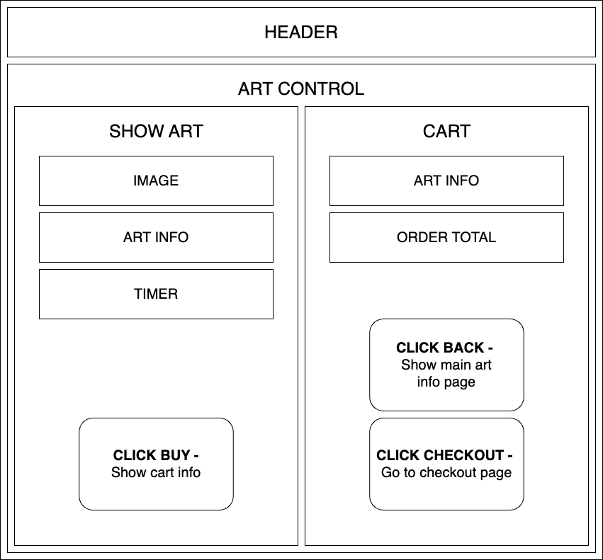
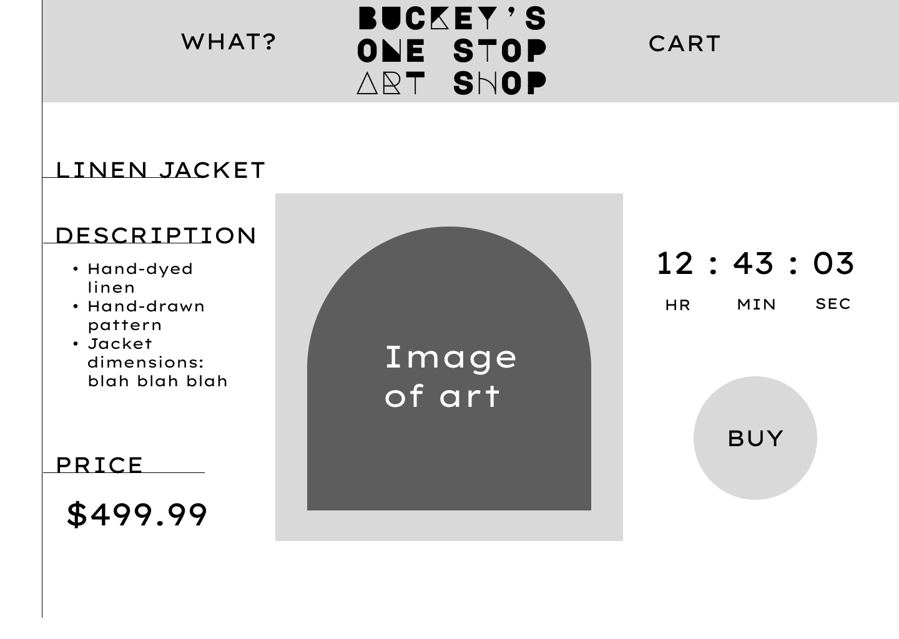

### React Components Diagram

### Sample Main Page (Figma)

### Research To-Dos
* ~~Read Typescript Docs~~
* ~~Study/practice basic algorithms in Typescript~~
* ~~Compare NoSQL with React to C# API, list pros and cons for project needs~~
* ~~Study/practice vite configs for project~~

### Project To-Dos
* ~~Design page in Figma~~
* ~~Map single page React app~~
~~* Build out static page w/out info using React/TS~~
  ~~* add seed data to state~~
  ~~* hooks~~
* ~~Basic CSS formatting for page~~
* Build art db
* Connect art db to frontend
* Polish styling

### Research & Planning Log
#### Friday 07/07

* 8:45: map project research outline and to-dos
* 9:00: practice TS with exercism
* 9:30: read TS docs
* 10:00: practice TS with exercism
* 10:30: read TS docs
* 11:00: Collect sample layouts/ideas
* 11:30-12: Page layout sketches
* 1 - 2pm: drew some ideas
* 2:30: Draw first figma sketch
* 3:00: Draw React component diagram

#### Friday 07/14

* 3:00 Research Firebase realtime
* 3:30 Research firebase realtime
* 4:30 Seed smaple firebase realtime data

#### Friday 07/21

* _Plan for today:_ 
  * _build out admin page with form to submit art to db_
    1. Separate AdminControl
    2. Routing to /admin
    3. Setup user auth in Firebase
    4. AdminControl has button to form once logged in
    5. On form submit, object is added to Firebase db
    6. Figure out input to add art piece to form and add to Firebase Store
  * _admin homepage allows scheduling of art pieces_
    1. Queue and All Art different components.
    2. On queue page, add art to queue
    3. On queue page, reorder queue
    4. Set timer for each item on the queue page.
    5. Queue is category in Realtime DB, so queue is an array of objects with reference ids and timer and order number in the queue
    6. Frontfacing webpage grabs item first in the queue.

#### Tuesday 07/25

* _Plan for today:_
  * Implement timer and start button in queue
  * Connect frontend to queue collection, display timer
  * Timer
    1. Universal timer that admin sets.
    2. Start and stop button on the queue
    3. 
