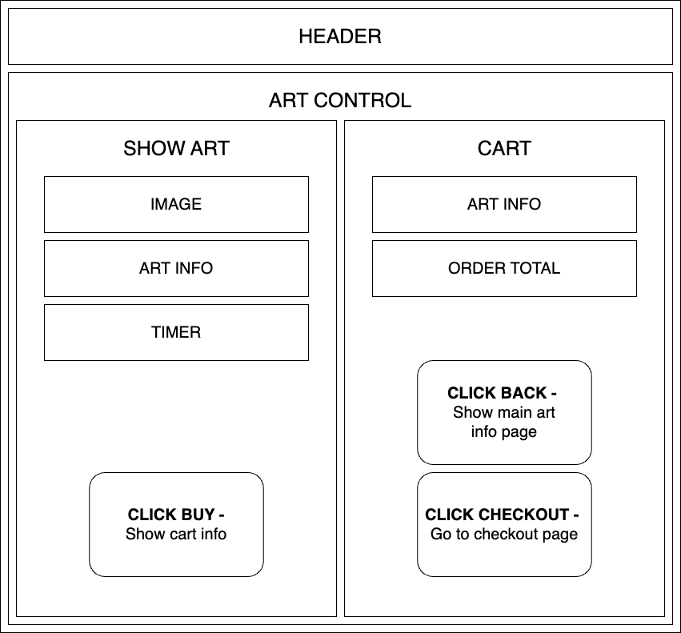
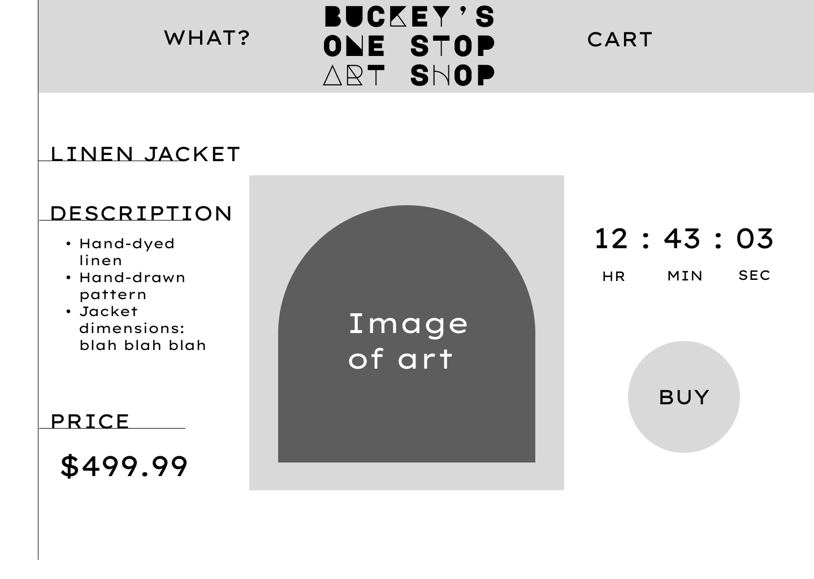

### React Components Diagram

### Sample Main Page (Figma)

### Research To-Dos
* Read Typescript Docs
* Study/practice basic algorithms in Typescript
* Compare NoSQL with React to C# API, list pros and cons for project needs
* Study/practice vite configs for project

### Project To-Dos
* Design page in Figma
* Map single page React app
* Build out static page w/out info using React/TS
* Basic CSS formatting for page
* Build art db
* Connect art db to frontend
* Polish styling

### Research & Planning Log
#### Friday 07/07

* 8:45: map project research outline and to-dos
* 9:00: practice TS with exercism
* 9:30: read TS docs
* 10:00: practice TS with exercism
* 10:30: read TS docs
* 11:00: Collect sample layouts/ideas
* 11:30-12: Page layout sketches
* 1 - 2pm: drew some ideas
* 2:30: Draw first figma sketch
* 3:00: Draw React component diagram